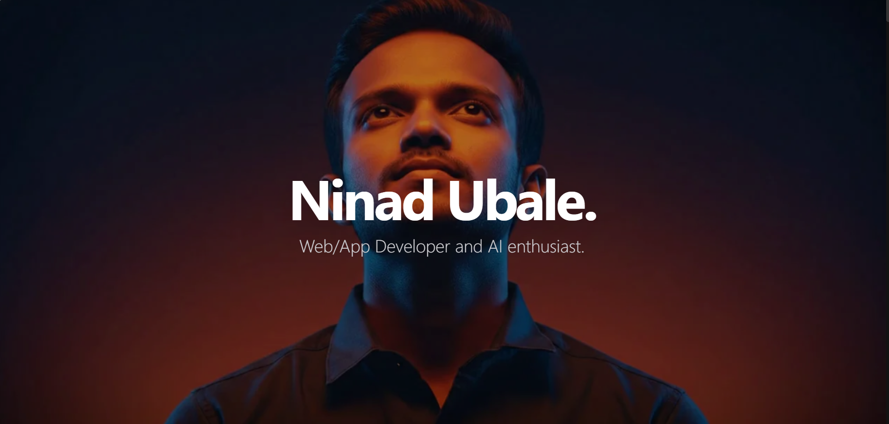

# Modern Developer Portfolio | Cinematic Scrollytelling

[](https://nextjs.org/)
[](https://reactjs.org/)
[](https://tailwindcss.com/)
[](https://www.framer.com/motion/)
[](https://vercel.com/)

A high-end, cinematic portfolio experience built for the modern web. This project combines **Next.js 14**, **Framer Motion**, and **HTML5 Canvas** to create a seamless "Scrollytelling" journey that highlights technical expertise and professional achievements with premium aesthetics.

🔗 **Live Demo:** [ninad-ubale-portfolio.vercel.app](https://ninad-ubale-portfolio.vercel.app/)

---

## ✨ Features

- 🎬 **Cinematic Scrollytelling**: High-performance scroll-linked image sequence rendering using HTML5 Canvas.
- 💎 **Glassmorphism UI**: Modern, premium design system with subtle blurs, borders, and dark-themed aesthetics.
- 📱 **Fully Responsive**: Optimized for every screen size, from mobile devices to ultra-wide monitors.
- 📧 **Interactive Contact Form**: Integrated with **EmailJS** for direct client-side email delivery with real-time feedback.
- ⚡ **Performance Optimized**: Built with Next.js App Router for superior speed and SEO.
- 🎭 **Fluid Animations**: Smooth entrance animations and micro-interactions powered by Framer Motion.
- 📄 **Resume Download**: Securely hosted resume for instant accessibility.

---

## 🛠️ Tech Stack

- **Framework**: [Next.js 14](https://nextjs.org/) (App Router)
- **Library**: [React 18](https://reactjs.org/)
- **Animations**: [Framer Motion](https://www.framer.com/motion/)
- **Styling**: [Tailwind CSS](https://tailwindcss.com/)
- **Icons**: [Lucide React](https://lucide.dev/)
- **Form Service**: [EmailJS](https://www.emailjs.com/)
- **Type Safety**: [TypeScript](https://www.typescriptlang.org/)

---

## 📸 Preview



---

## 🚀 Getting Started

### Prerequisites

- Node.js 18.0 or later
- npm or yarn

### Installation

1. **Clone the repository:**
   ```bash
   git clone https://github.com/NinadUbale/portfolio.git
   cd portfolio
   ```

2. **Install dependencies:**
   ```bash
   npm install
   ```

3. **Set up Environment Variables:**
   Create a `.env.local` file in the root directory and add your EmailJS keys:
   ```env
   NEXT_PUBLIC_EMAILJS_SERVICE_ID=your_service_id
   NEXT_PUBLIC_EMAILJS_TEMPLATE_ID=your_template_id
   NEXT_PUBLIC_EMAILJS_PUBLIC_KEY=your_public_key
   ```

4. **Run the development server:**
   ```bash
   npm run dev
   ```
   Open [http://localhost:3000](http://localhost:3000) with your browser to see the result.

---

## 📂 Folder Structure

```text
├── public/              # Static assets (images, pdfs, sequence frames)
├── src/
│   ├── app/             # Next.js App Router (Layouts & Pages)
│   ├── components/      # Reusable UI components (Hero, Projects, Contact, etc.)
│   ├── lib/             # Utility functions and data schemas
│   └── styles/          # Global styles & Tailwind config
├── .env.local           # Local environment variables (ignored by git)
└── next.config.mjs      # Next.js configuration
```

---

## 🌐 Deployment

The easiest way to deploy this project is via the [Vercel Platform](https://vercel.com/new).

1. Push your code to GitHub.
2. Import the project into Vercel.
3. Add your Environment Variables in the Vercel project settings.
4. Hit **Deploy**!

---

## 🔮 Future Improvements

- [ ] **Blog Section**: Integration with MDX for technical writing.
- [ ] **Dark/Light Mode**: Dynamic theme switching (currently optimized for Dark).
- [ ] **Analytics**: Integration with Vercel Analytics for tracking engagement.
- [ ] **Localized Content**: Multilingual support.

---

## 👤 Author

**Ninad Ubale**
*Web/App Developer & AI Enthusiast*

- LinkedIn: [ninad-ubale](https://linkedin.com/in/ninad-ubale)
- GitHub: [@NinadUbale](https://github.com/NinadUbale)

---


<p align="center">Built with 🤍 by Ninad Ubale</p>
